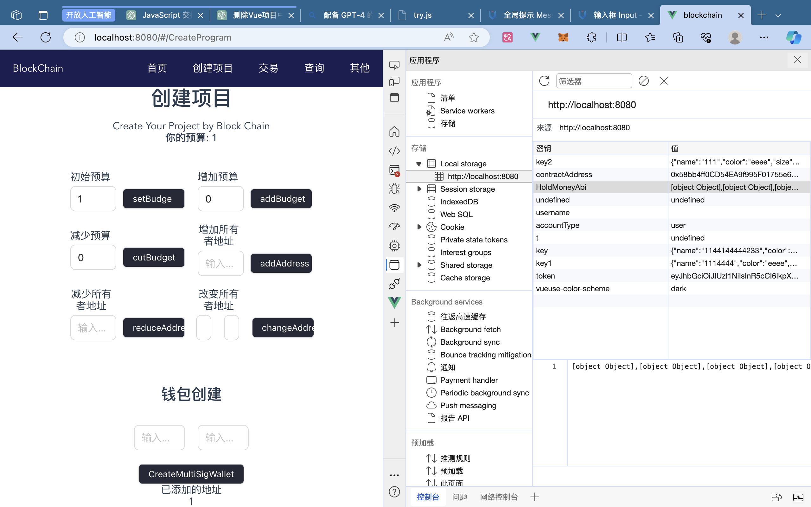

```
请确保你操作的合约实例是同一个, 否则可能会报错显示没有Provider
有一些组件通信的方式可以实现操作它, 但是我目前没有成功, 后续再试试


使用前端的那一坨export,解构语法, 导入导出, 没法通过模块化的方式解决问题; 

最后将所有东西放在一个页面解决的; 

记得深入学一下解构语法和definedExpose;
也再学一下使用vuex的方式


```

```
记住用ref实例的时候, 模板外要加value
```

```

web3.eth.Contract是用于创建合约实例的，无论是新部署的还是现有的。
window.ethereum.request是与用户账户互动的主要方法。
contract.deploy是部署新合约到Ethereum网络的方法。


```


```
useStore() 和直接从文件导入store有几点区别，主要涉及到作用域、组件的解耦、以及Vuex版本：

作用域：

const store = useStore(); 是从当前Vue实例中获取store的方式。它始终返回与当前组件关联的Vue根实例的store。
import store from '@/store/index' 是一个直接导入。无论你在哪里导入它，它都将始终是同一个store实例。
解耦：

使用 useStore() 使得组件与特定store文件的具体路径解耦，这可能使得更改项目结构或重构变得更容易。
直接导入具体的store文件使组件与该路径紧密耦合。
测试：

useStore() 可能使组件测试变得更容易，因为你可以为Vue实例提供不同的store来进行测试，而不是依赖于单一的全局store。
直接导入的store是一个固定的实例，要替换或修改它可能会更复杂。
Vuex版本：

useStore() 是Vuex 4（适用于Vue 3）中的新方法。
在Vuex 3和Vue 2中，你通常会通过this.$store在组件内部访问store，或者直接导入store。
综上所述，这两种方法各有优势，选择哪种方法取决于你的需求。如果你想要更大的灵活性和解耦，useStore() 可能是一个更好的选择。如果你想要一个简单明了的方法，并且知道你的store结构不太可能改变，直接导入可能更适合你
```


```
当你遇到Web3ValidatorError时，这通常是由于你传递给web3.js方法的参数不正确或不完整。
```


```
确保你的合约ABI和字节码是最新的：
确保HoldMoneyAbi和HoldMoneyJson.bytecode是从holdmoney.sol的最新编译版本中获取的。这是调用合约函数时最常见的错误源。


```

```
const web3 = new Web3(window.ethereum);
const contract = new web3.eth.Contract(HoldMoneyAbi, deployedContractAddress);

web3 是你与以太坊节点（在这种情况下是Metamask）交互的主要接口。
contract 是你与特定合约交互的接口，它已经被绑定到了部署的地址 deployedContractAddress。


```

#### web3实例 和 合约对象
```
if (!state.web3 || !state.contract) {
  throw new Error("Web3或合约实例尚未初始化");
}
```
你实际上是在确认：
你是否已经与以太坊节点建立了连接（通过 web3 实例）。
你是否已经准备好与特定合约交互（通过 contract 实例）。


注意哈, 只要确定了合约部署的地址和和abi, 它就唯一确定了; web3节点是无所谓的; 


#### 如何访问一个智能合约的变量 
```
变量的可见性：如果mu是public的，Solidity会自动为你生成一个getter函数，你可以直接使用它。如果mu是private或internal的，你需要在合约中自己写一个getter函数。

async function getMuValue() {
  const muValue = await holdMoneyContract.methods.mu().call();
  console.log(muValue);
}

```

#### 使用vuex的问题, 还是无法保证实例是同一个; 解决办法: 使用LocalStorge


但是这里出现了新的问题, localstorge存储的是一个字符串, abi有格式问题;

我的解决办法是, 别用它存,全局引入就行; 

